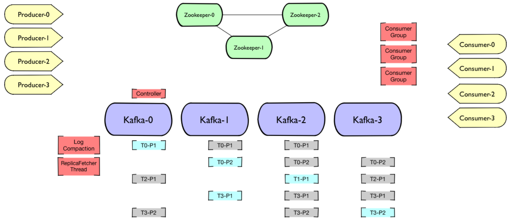
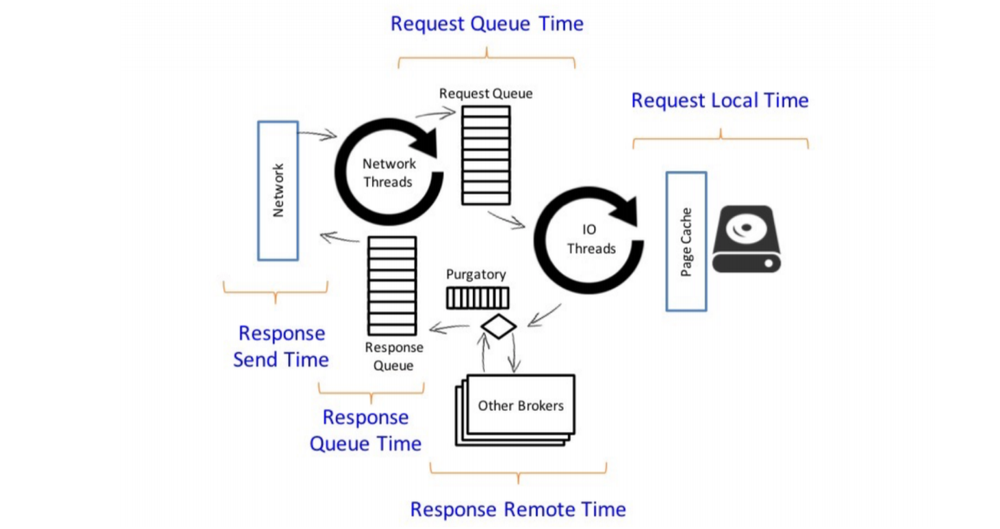
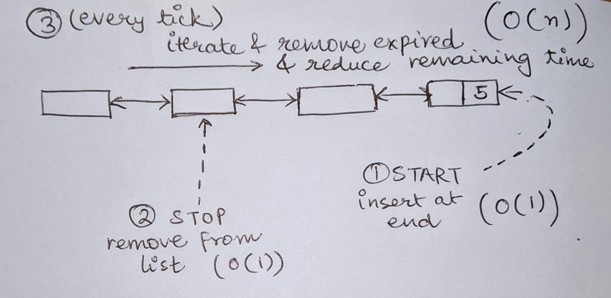
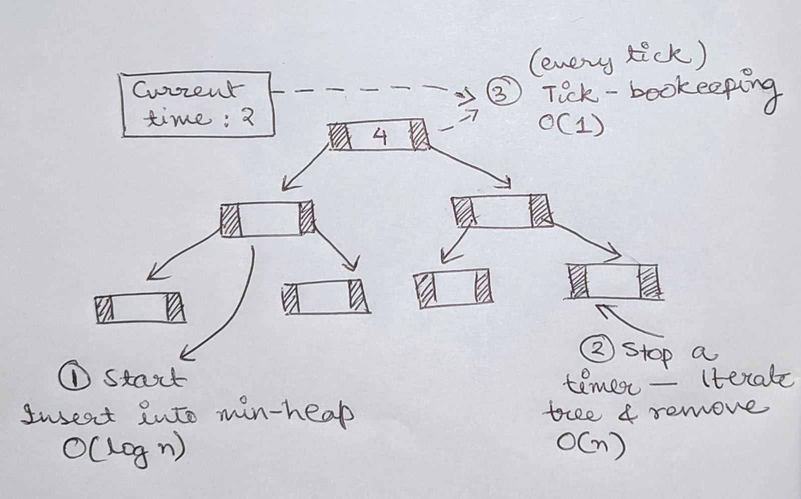
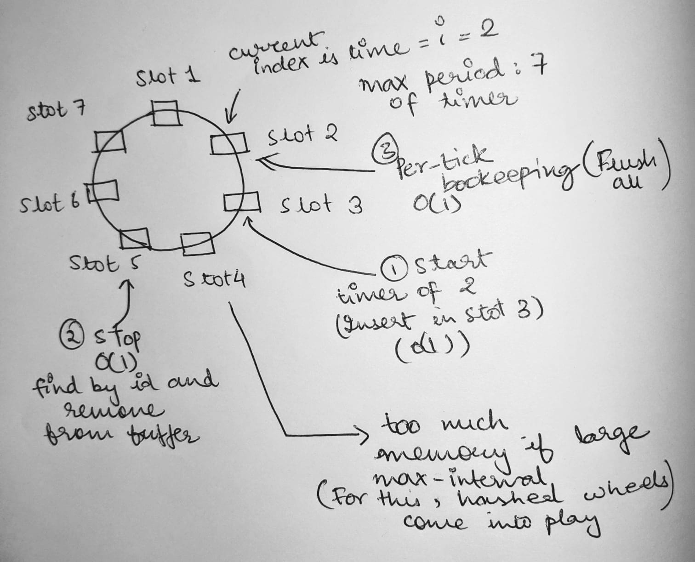
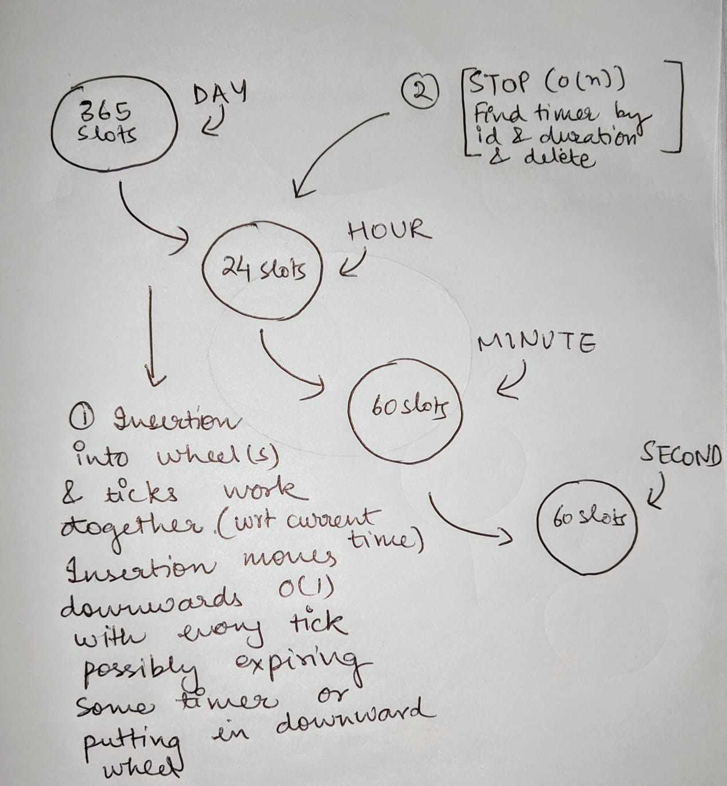

### Introduction

Apache Kafka is a distributed stream-processing software, enabling high throughput & low-latency, real-time event processing & data feeds. If I It has a distributed architecture, whereby data in each topic is replicated to a set of brokers.

*Kafka Architecture in Apache Kafka [Image Credits to [Pere Urbón](https://speakerdeck.com/purbon) from [Confluent](https://www.confluent.io/)]*

As described from above image, each partition of a topic is replicated to at-least 3 brokers. Out of the three brokers of a topic-partition, one of them is the **leader**, which serves all write requests to that partition. The leader then sends the data to the members of the replica set to replicate the published message. Each cluster also has a **[controller](https://cwiki.apache.org/confluence/display/KAFKA/Kafka+Controller+Internals)**, which is responsible for managing state of topic-partitions, replicas or administrative tasks like reassigning partitions, deciding leader for topic-partition from In-sync replicas in-case of failures, etc.

*Request Processing in Apache Kafka [Image Credits to [Pere Urbón](https://speakerdeck.com/purbon) from [Confluent](https://www.confluent.io/)]*

Most of what a Kafka broker does is process requests sent to the partition leaders from clients, partition replicas, and the controller. Kafka has a binary protocol (over TCP) that specifies the format to the requests and how brokers respond to them. 

### Purgatory

The purgatory in Kafka holds any request that has not fulfilled all tasks to succeed and has also not resulted in an error. kafka has many request types, that can't be immediately answered, for example, a *publish* request with `acks=all` needs to here acknowledgement from all brokers before responding. If the request isn't fulfilled within a timeout, it's supposed to fail. 

In this post, I'll write about the data structure Apache Kafka's purgatory uses for keeping track of large number of outstanding requests and keeping track of expiry timers. This post is largely only a summary of the [post](https://www.confluent.io/blog/apache-kafka-purgatory-hierarchical-timing-wheels) by Yashiro Matsuda and [this](https://blog.acolyer.org/2015/11/23/hashed-and-hierarchical-timing-wheels/) post summarizing the [paper](http://www.cs.columbia.edu/~nahum/w6998/papers/sosp87-timing-wheels.pdf) that introduced hashed and hierarchical timing wheels. This is a very interesting data structure used in a highly scalable system and hence, I'll try to summarize it as part of my post :)

#### Problem Statement

In a summary, the problem is to efficiently keep track of a number of request with timeouts. The model used for timers consists of the following operations:

* *Start*: Clients can specify to start a timer duration (with a callback to use if timer expires)
  * *Stop*: Stop a timer, given an identifier of the timer.
* *Per-tick book-keeping*: On every tick of the timer, there is a check whether a request has expired. If so, it moves to expiry processing.
* *Expiry processing*: Calls the expiry callback and removes the timer. 

#### Solutions

**List and Tree of Timers**

There are many approaches to solving this problem of keeping track of a number of such timers. One approach would be to maintain an unordered list of timers.

|  |
| :----------------------------------------------------------: |
|     *Unordered List of timers using doubly-linked list*      |

 
Another approach is to use a min-heap to store the timers, and compare the current time with the head of the tree during per-tick book-keeping to see if a timer is expired.

|  |
| :----------------------------------------------------------: |
|                 *Ordered Min-Heap of timers*                 |

 
Apache Kafka's old design made use of Java's [DelayQueue](https://docs.oracle.com/javase/7/docs/api/java/util/concurrent/DelayQueue.html), which was used to implement a timer, and a hashmap of watcher lists. However, this approach didn't scale well with a number of outstanding requests, and that the completed requests were only deleted from the hashmap and the queue during condition checking (when request timer expired). Having a purge thread for removing solves the issue, but increases the load on CPU.

**Hashed and Hierarchical Timing wheels**

The above approaches of using a list or ordered-tree work really well with a small number of timers.  If there is a bound on the maximum period of a timer, a circular list of timers provides with a solution that brings down the complexity of insertion and tick book-keeping to O(1).

|  |
| :----------------------------------------------------------: |
|   *Simple Wheel of timers with a maximum period of timer*    |

 
With increasing maximum period of a timer, the space a simple timing wheel grows. One solution to this is to have hashed timing wheels where each buffer is either of the above mentioned solutions (unordered list of timers or ordered tree of timers). Another solution which now Kafka uses for it's purgatory is hierarchical timing wheels, using multiple wheels of different granularity. (Note that the wheels can have any granularity, not just days, minutes or seconds). Insertion and tick-timing go hand-in-hand. Every tick, it is checked through every cell (for instance, from day wheel -> second wheel) if a timer expired for the current wheel. If so, there can be two cases: the timer is expired and needs to be removed from the data structure or it should be moved to another wheel of lower hierarchy (the buffer for each movement of the timer is decided with respect to the current time).

|  |
| :----------------------------------------------------------: |
| *Heirarchical Timing Wheel that with a big upper period of timer with optimized space usage* |
