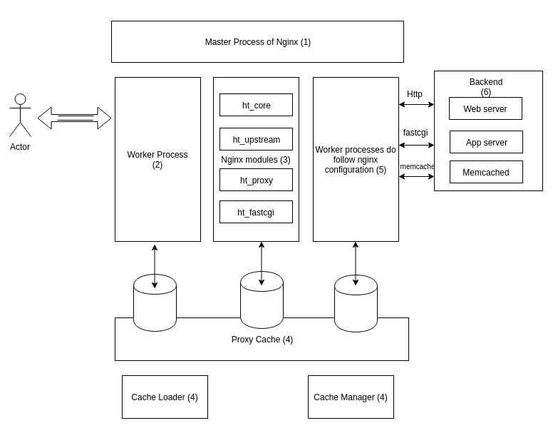
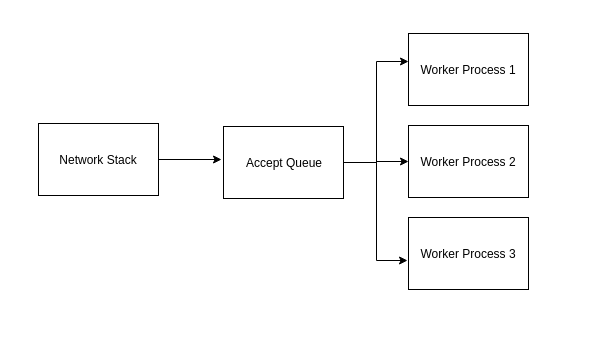

Nginx is a pretty cool system with an event-driven architecture and is used primarily as a load balancer, reverse proxy and HTTP cache. Nginx runs a single master process performing "important" operations enabling proper actions by other processes and only a limited number of worker processes which do the actual connection handling/request processing.

#### Why Nginx?

Most web servers create single process/thread per connection. A thread or process is self-contained set of instructions that an OS can schedule on CPU core. Processes and threads consume resources, and launching one thread/process per connection can limit the performance of a web server quite fast. This is primarily because

* **Initialization of a new process/thread is costly**: Initialization of a process or thread means preparation of a new runtime environment. CPU is utilized in allocation of heap and stack memory for a process and in creation of a new execution context for a new thread/process. 
* **Thread/Process thrashing/Context Switch**: Each thread/process occupies a significant amount of memory. An HTTP connection is represented by a file descriptor and a very small amount of memory. With creation of a separate thread or process, a lightweight object is handled with a very heavy weight operating system object like process/thread. During I/O, the process/thread just sits there occupying memory. Not only that, with context switch between different processes/threads for handling different connections, a system might poorly perform due to thrashing.

An Nginx worker process however, never blocks on network traffic. Due to the event-based architecture, it is very fast and can handle many connections simultaneously within a single process.

#### Architecture of Nginx

In the figure below, I've tried to illustrate the architecture of Nginx, and in each sub-topic below, I'll try to describe the steps in which it handles network connections.

**Master Process (1)**: This is the process that starts when nginx is started. It runs all the privileged operations listed below. This process also enables dynamic loading of nginx configuration without re-deployment of instances:

1. reading and validating the configuration

2. creating, binding and closing sockets
3. starting, terminating maintaining configured number of worker processes
4. reconfiguring the server without interruption
5. controlling non-stop binary upgrades
6. re-opening closed "log" files
7. compiling embedded perl scripts

**Worker Processes (2)**: Worker processes are the only processes which do the actual work of handling multiple connections in a non-blocking fashion, reducing the number of context switches and preventing thread/process thrashing. Some important points about worker processes is as follows:

1. Each worker process is initialized by the configuration validated by the master process. It is provided with a set of listen sockets by the master process. In the standard model of nginx, there is a single listen socket, and multiple worker process. The new connections sit in a single kernel data structure (the listen socket), and multiple worker processes do both `accept()` calls and processing of requests. [This](https://blog.cloudflare.com/the-sad-state-of-linux-socket-balancing/) post explains how Linux distributes/load-balances different accept() calls (blocking and non-blocking)

   

2. Events are initiated by new connections (handled by `accept()`), and each connection enters a state machine of a type based on the protocol (raw TCP, SMTP, IMAP, POP3, etc). The state machine contains the rules for handling of the connection and is completely event-based.
   * An event on the listen socket means that a client has started a connection. The worker creates a new connection socket.
   * An event on a connection socket means that the client has made a new request. The worker responds promptly. The connection is maintained for as long as the keep-alive, which is handled by the configuration.
 
3. Deciding on the number of worker processes: These processes are **single-threaded**, and the connections are processed in highly efficient run loop. If serving the connections is CPU-intensive, the Nginx developers recommend running 1 worker process per CPU core, so as to avoid context switch and maximum usage of a single core per process. If however, if serving requests to connections is I/O intensive, they recommend number of worker processes to be 1.5/2 times the number of cores. There is a second parameter `worker_connections`, which specifies the upper limit on the number of connections a single worker process will handle.

**Nginx modules (3)**: Nginx has a modular architecture which makes it very easy for extending the functionality and introducing new features. Modules constitute of functionality relating to the **presentation** and the **application** layer. Main functionality is around reading/writing to the network & storage, transform content, do outbound filtering (like load sharding/distribution based on request URL), and passing requests to upstream servers. 

**Caching using Nginx (4)**: Nginx also supports caching static content. The other two types of processes that nginx runs are:

* cache loader: This process loads the cache into memory and exits. It is scheduled again based on the expiration policies for the cache.

- cache manager: This process runs periodically and prunes entries from the caches to keep them within the size limit.

This post gives a rough idea of the architecture of Nginx. In the next few posts, I plan to describe different load balancing techniques that can be configured with Nginx, understanding some basic configuration of Nginx and caching with nginx. 