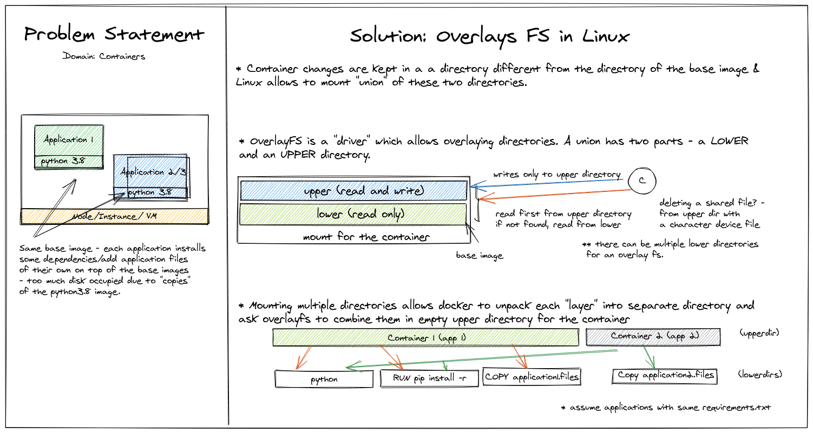

This post is a small diagram discussing overlay file systems used by containers like docker for saving disk space. The "layers" we see as docker runs through every command of `Dockerfile` is result of docker building another lower directory (possibly reusable) to the cascaded overlay file system used for a container. Since container systems like docker use overlays, re-building an existing image with different tag doesn't go through the build steps like installing packages again! :)
<div class="img_container">
    <p align="center">
        
    </p>
</div>

### Show me some code/commands!
* Union one lower directory and an upper directory:
```
sudo mount -t overlay overlay -o lowerdir=./lower,upperdir=./upper,workdir=./parent ./parent
```

* Union multiple lower directories and one upper directory:
```
sudo mount -t overlay overlay -o lowerdir:./lower_1:./lower_2:./lower_3,upperdir=./upper,workdir=./parent ./parent
```

### References/More to read

* Julia Evans' blog: <https://jvns.ca/blog/2019/11/18/how-containers-work--overlayfs/>
* Docker: <https://docs.docker.com/storage/storagedriver/>